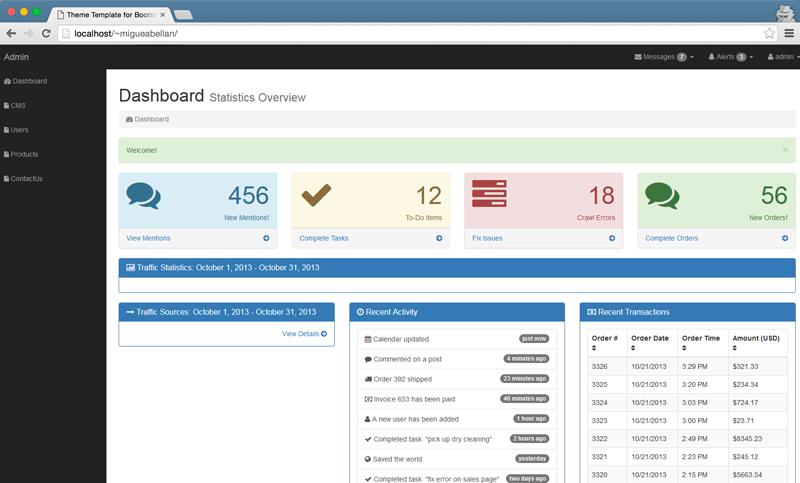

# CodeIgniter 3.0.4 - Admin Bootstrap 3.3.6

[](https://packagist.org/packages/codeigniter/framework) [](https://packagist.org/packages/codeigniter/framework) [](https://packagist.org/packages/codeigniter/framework) [](https://packagist.org/packages/codeigniter/framework)


This package installs the offical [CodeIgniter](https://github.com/bcit-ci/CodeIgniter) (version `3.0.*`) with secure folder structure via Composer.

You can update CodeIgniter system folder to latest version with one command.

## Folder Structure

```
codeigniter/
├── application/
├── images/
├── system/
├── template/
├── composer.json
├── composer.lock
└── vendor/
    └── codeigniter/
        └── framework/
```


## Requirements

* PHP 5.3.2 or later
* `composer` command (See [Composer Installation](https://getcomposer.org/doc/00-intro.md#installation-linux-unix-osx))
* Git


### What is CodeIgniter

CodeIgniter is an Application Development Framework - a toolkit - for people who build web sites using PHP. Its goal is to enable you to develop projects much faster than you could if you were writing code  rom scratch, by providing a rich set of libraries for commonly needed tasks, as well as a simple interface and logical structure to access these libraries. CodeIgniter lets you creatively focus on your  roject by minimizing the amount of code needed for a given task.


### What is Bootstrap

This is a template showcasing the optional theme stylesheet included in Bootstrap. Use it as a starting point ti create something more unique by bulding on or modifying it.




## How to Use

### Install CodeIgniter

```
$ composer create-project migueabellan/CodeIgniter-Admin
```

You need tu add a salt var in your file config.

```
$config['salt'] = 'YOUR_SALT';
```

Your user table is as a follow:

```
CREATE TABLE `ci_admin` (
  `id_admin` int(10) unsigned NOT NULL AUTO_INCREMENT,
  `user` varchar(45) NOT NULL,
  `pass` varchar(45) NOT NULL,
  PRIMARY KEY (`id_admin`)
) ENGINE=InnoDB AUTO_INCREMENT=2 DEFAULT CHARSET=latin1;
```


### Update CodeIgniter

```
$ composer update
```

You must update files manually if files in `application` folder or `index.php` change. Check [CodeIgniter User Guide](http://www.codeigniter.com/user_guide/installation/upgrading.html).


## Reference

* [Composer Installation](https://getcomposer.org/doc/00-intro.md#installation-linux-unix-osx)
* [CodeIgniter](https://github.com/bcit-ci/CodeIgniter)
* [Translations for CodeIgniter System](https://github.com/bcit-ci/codeigniter3-translations)
